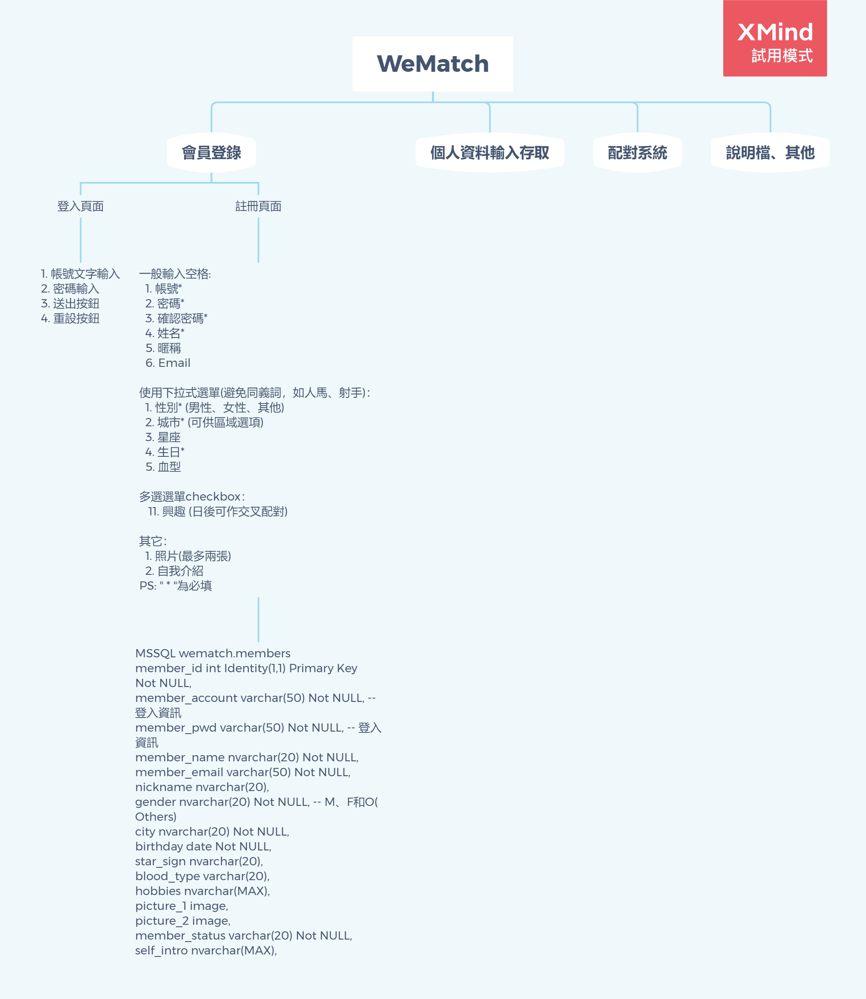
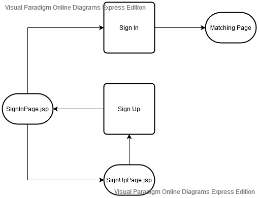
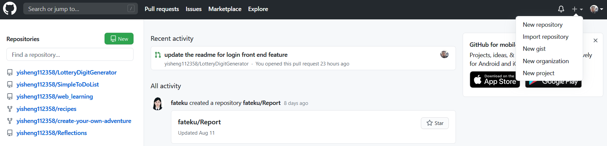

# WeMatch

這是用來練習使用JSP、Servlet的課堂作業，也是為了練習git和之後的期末專題小試身手。
P.S. 此檔案為GitHub上常有之說明檔，副檔名為.md，為markdown file，可以用[Typora](https://typora.io/)或VS code編輯。

------

## 系統規劃

### 總體規劃

以下為系統規劃的功能分析圖，盡量往下細分，以便開分支(branch)時能明確劃分範圍，例如「登入頁面」及以下內容即可自行圈劃成為一個分支的內容。對README.md和WeMatch.xmind的修改目前可嘗試直接由master branch修改看看(因為頻率可能會很頻繁，開branch可能不方便)，若不合適可再討論更加合適的作法。

P.S. 可使用[XMind](https://www.xmind.net/)來編輯WeMatch.xmind，並匯出下圖。此圖的連結請使用相對路徑：ImageInReadme/WeMatch.png。

### 系統使用流程

- Login Page：使用者可以執行登入的動作或是註冊的動作。
- Sign Up Page：使用者輸入相關資料並註冊送出，送出之後即重新轉回至Login Page。
  P.S. 未來可以再增加、註冊成功或失敗提示頁面、email驗證頁面…等頁面。

### 工作分支

請自行增加以下分支名稱，並以「未開發」、「"開發人員名稱"-"yyyy-mm-dd"-開發中」、「"開發人員名稱"-"yyyy-mm-dd"-結案」三種狀態來表示開發進度。

1. 登入頁面 (yisheng112358-2020-08-20-開發中)

2. 註冊頁面(iwei-eeit11732-2020-08-20-開發中)

3. 註冊頁面SQL程式(yisheng112358-2020-08-20-結案)

4. 配對系統 (ax785412-2020-08-20-開發中)

5. 註冊頁面SQL程式-補資料(yisheng112358-2020-08-20-結案)

6. bugfix-sql-for-sign-up-page-submit-without-image(yisheng112358-2020-08-21-開發中)

   P.S. 分支合併(merge)之後若有任何修改，不管範圍再小，將必須另外再開分支。

------

## 如何從GitHub建立repository？

